# 卓越之剑 OPUS 项目分析结论

**整理日期**：2026-04-03

---

## 一、项目整体架构

### 1.1 整体架构图

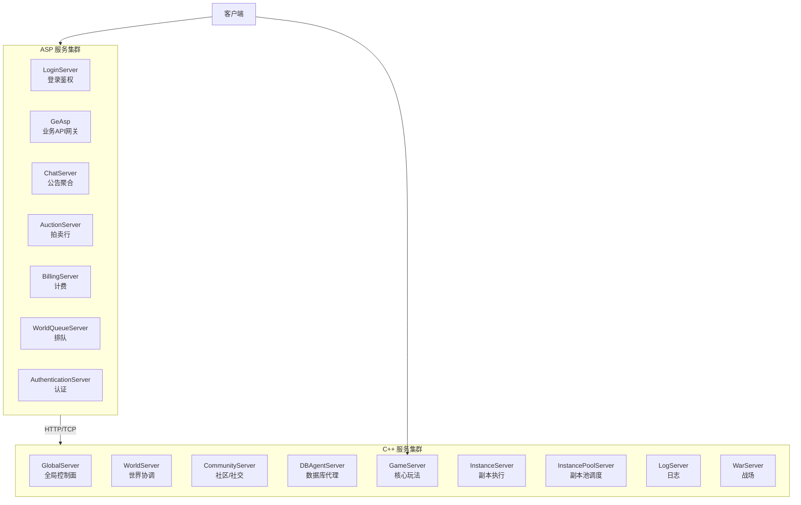

### 1.2 服务职责矩阵

| 服务 | 类型 | 职责 |
|------|------|------|
| GlobalServer | C++ | 全局控制面，跨world总入口 |
| WorldServer | C++ | world级协调中心（频道、跨服、用户注册） |
| CommunityServer | C++ | 社区/关系（组队、公会、社交协调） |
| GameServer | C++ | 核心玩法（角色、地图、战斗、道具） |
| InstancePoolServer | C++ | 副本实例池调度 |
| InstanceServer | C++ | 具体副本执行节点 |
| DBAgentServer | C++ | 数据库访问中介（多连接分片） |
| LogServer | C++ | 日志聚合/持久化 |
| LoginServer | C# | 登录鉴权入口 |
| GeAsp | C# | 综合业务API网关 |
| ChatServer | C# | 世界公告聚合发送 |
| AuctionServer | C# | 拍卖行HTTP接口 |
| BillingServer | C# | 支付/计费通道 |

---

## 二、启动编排

### 2.1 启动顺序流程

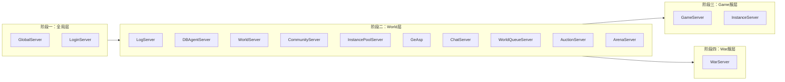

---

## 三、通信机制

### 3.1 IOCP + 工作线程池模型

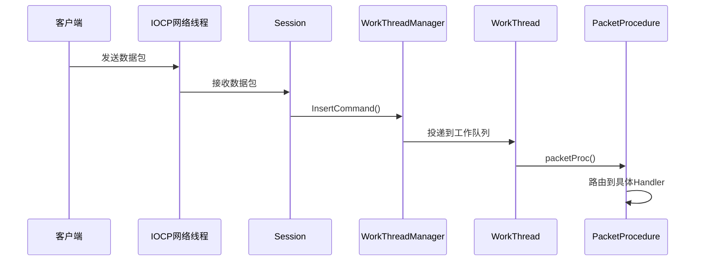

### 3.2 服务注册与重连流程

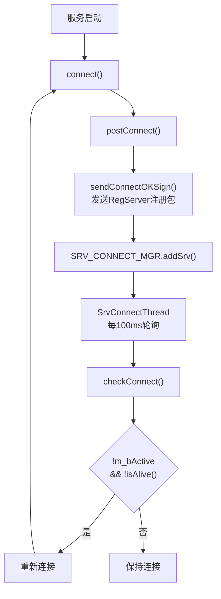

### 3.3 多通道消息路由

| CommandType | 来源 | 处理 |
|------------|------|------|
| COMMAND_TYPE_USER | 客户端C2S | User_Handler_Packet |
| COMMAND_TYPE_WORLD_SRV | WorldServer下发 | User_Handler_WorldSrv |
| COMMAND_TYPE_COMMUNITY_SRV | CommunityServer | User_Handler_CommunitySrv |
| COMMAND_TYPE_DBAGENT_SRV | DBAgent回包 | User_Handler_DBAgentSrv |

---

## 四、配置体系

### 4.1 配置加载顺序

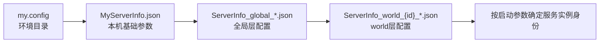

### 4.2 数据表加载顺序（技能系统依赖链）

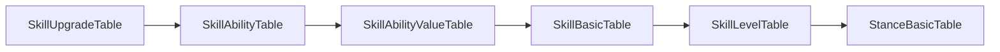

### 4.3 数据表加载顺序（角色系统依赖链）

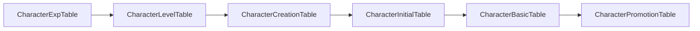

---

## 五、用户状态管理

### 5.1 用户生命周期状态机

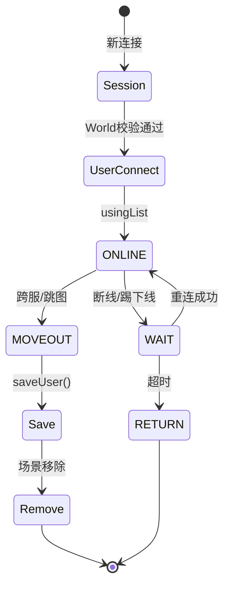

### 5.2 内存缓存结构

| 缓存 | 含义 |
|------|------|
| m_usingList | 在线用户，完整持有对象 |
| m_waitList | 等待态，断线重连窗口 |
| m_accListByAccountId | 账号→User索引 |
| m_listByFamilyName | 家族名→User索引 |
| m_freeList | User对象池复用 |

### 5.3 跨服一致性保证原则

1. **单主写**：同一时刻只有一个服"主写"该用户内存态
2. **短离线不丢态**：WAIT保留内存对象，允许快速重连
3. **跨服前先收口**：MOVE_OUT前做saveUser + 场景移除
4. **最终落库兜底**：DBAgent异步落地保证最终一致

---

## 六、业务系统详解

### 6.1 游戏核心系统域

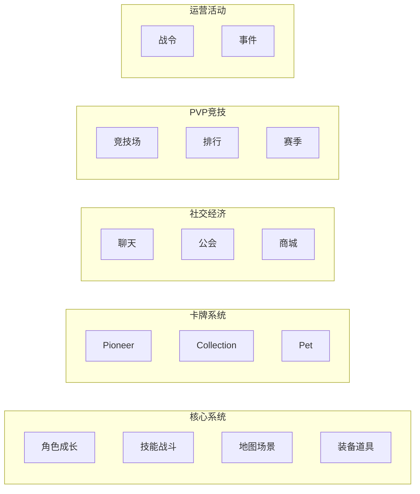

### 6.2 技能系统层次

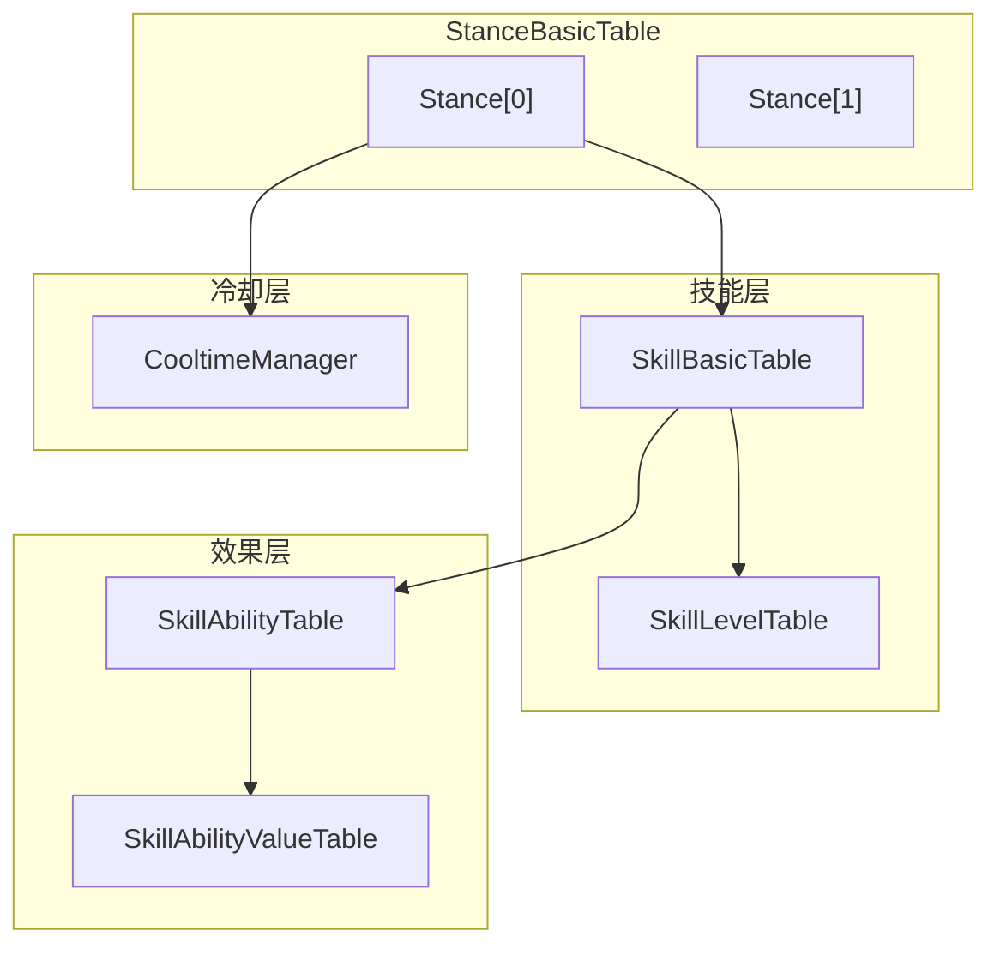

---

## 七、排错字典

### 7.1 启动期报错

| 报错日志 | 归属 | 第一优先检查 |
|---------|------|-------------|
| `DataManager Init failed!` | GameServer启动 | json语法/字段名/类型 |
| `dataTable load fail!` | DataTableManager | 最近改动的json表 |
| `Item Manager load failed!` | ItemManager | ItemBasic表重复ID/非法类型 |
| `check relation` 失败 | 跨表引用校验 | 等级/阶段不连续 |

### 7.2 运行期报错

| 报错日志 | 归属 | 第一优先检查 |
|---------|------|-------------|
| `not found curr Stance` | CharacterSkillManager | StanceBasic表是否包含stanceIdx |
| `not curr stance skill` | CharacterSkillManager | stance里是否挂了skill |
| `Fail addCollection` | CollectionManager | CollectionBasic字段合法性 |
| Pioneer强化异常 | PioneerManager | 强化表阶段对齐 |
| Pet孵化/合成异常 | PetIncubationManager | egg item/结果pet存在性 |

### 7.3 改表防炸服作业单

| 业务域 | 涉及表 | 固定回归 |
|-------|--------|---------|
| 角色 | CharacterBasic/Level/Exp/Promotion | 新建→进游戏→切stance |
| 技能 | SkillBasic/Level/Ability/Stance | 技能释放/升级/冷却 |
| Pioneer | PioneerTable/Rein/Pro | pioneer强化 |
| Collection | CollectionBasic/*Collection | 图鉴注册/领奖 |
| Pet | PetBasic/Incubation/Synthetic/Exchange | 孵化/合成/兑换 |

---

## 八、核心流程图汇总

### 图1：整体架构图

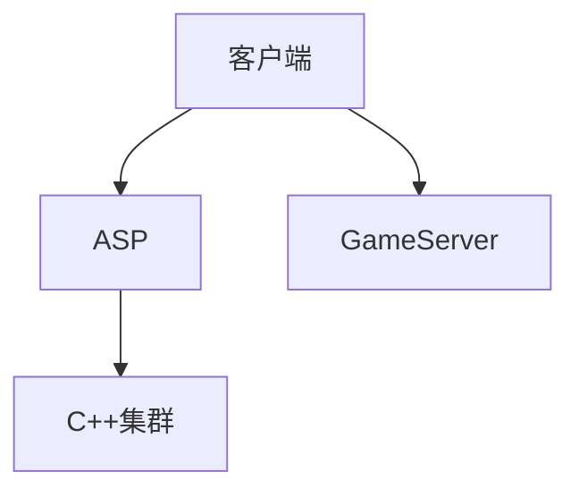

### 图2：用户状态机

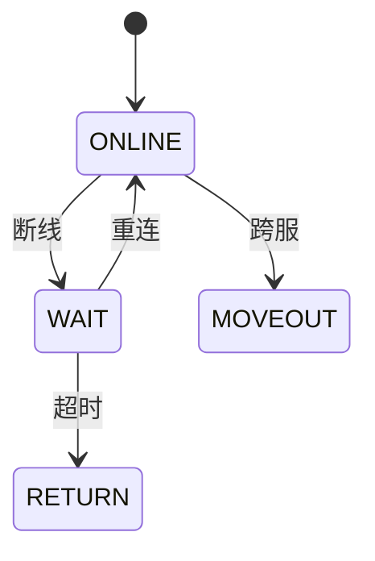

### 图3：跨服流程

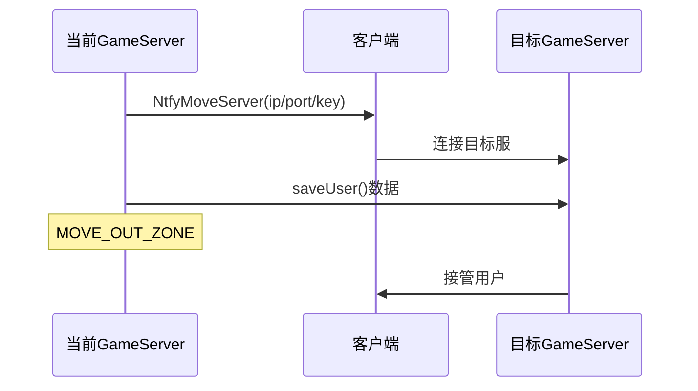

### 图4：消息处理流程

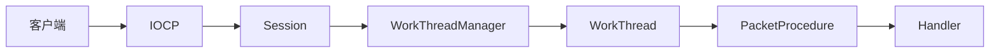

---

## 九、快速上手计划

| 天数 | 目标 | 关键动作 |
|------|------|---------|
| Day 1 | 跑通最小链路 | 启动Global+Login+World+DBAgent+Game，观察注册日志 |
| Day 2 | 理解启动依赖 | 读GameServer.cpp startingService() |
| Day 3 | 理解Game-World通信 | 读WorldSrvManager收发模型 |
| Day 4 | 理解Web服务入口 | 读LoginServer/Program.cs |
| Day 5 | 串联完整链路 | 跟一遍登录→进服完整包流转 |

---

## 十、扩展机制

### 新增服务实例
1. 在 `ServerInfo_world_xxx.json` 增加 `server_list` 项
2. 配置端口/ID/terrain_group
3. 运维脚本拉起

### 新增业务协议
1. FlatBuffers消息定义（PID + schema）
2. 在SessionManager注册packetProcedure
3. 在SendFunc/Manager增加发送封装

### 新增数据表
1. 加datatable(JSON)和SQL
2. 在DataManager侧加载
3. 业务manager初始化时接入
